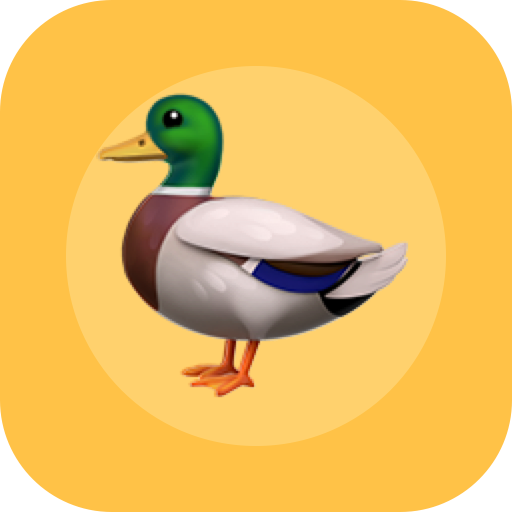

  

<h1 align="center">PrintYourDuck</h1>

  Turn CAD, STL, and prototype files into reviewed 3D print requests.

  <a href="https://printyourduck.com">Start a print request</a>
  ·
  <a href="https://printyourduck.com/api/mcp">Connect with MCP</a>
  ·
  <a href="https://github.com/printyourduck/printyourduck-mcp">Install the MCP helper</a>
  ·
  <a href="https://printyourduck.com/llms.txt">Read the agent context</a>

PrintYourDuck builds web and agent-friendly workflows for people turning CAD,
STL, STEP, 3MF, OBJ, and prototype files into real 3D printed parts.

The goal is simple: make it easier for makers, developers, designers, and small
prototype teams to send the right file, explain the part clearly, and get a
reviewed path toward a printable part.

## Public Entry Points

| Surface | Use it for |
| --- | --- |
| [PrintYourDuck website](https://printyourduck.com) | Uploading model files and starting a print request. |
| [Remote MCP endpoint](https://printyourduck.com/api/mcp) | Connecting MCP-capable agents to the PrintYourDuck request flow. |
| [Local MCP helper](https://github.com/printyourduck/printyourduck-mcp) | Finding a local STL, STEP, 3MF, OBJ, or ZIP file and submitting it for manual quote review. |
| [npm package](https://www.npmjs.com/package/@printyourduck/mcp) | Installing the local helper in MCP hosts that support npm packages. |
| [LLM context](https://printyourduck.com/llms.txt) | Giving assistants a compact, current overview of the service. |
| [OpenAPI schema](https://printyourduck.com/openapi.json) | Understanding the public quote request and status API shape. |

## Principles

- Clear file intake for practical prototypes, repairs, props, figures, and small
  batches.
- Agent workflows that can help prepare requests without hiding what is being
  submitted.
- Manual quote review before pricing, payment, or production decisions.
- Public documentation that stays readable for humans and useful for tools.
